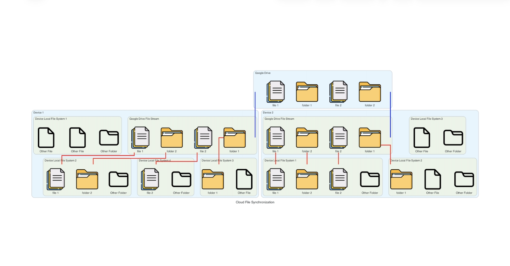

# selective-cross-device-file-sync

Selective cross-device file sync—Google Drive File Stream for transport (blue edges) + local symlinks to respect each device’s structure and expose only the files/folders I need (red edges).

**Instruction**
1. Get Google Drive from official site `https://support.google.com/drive/answer/10838124?hl=en`
2. Create soft link at desired location from the Google drive disk using `ln -s <target> <link>` for MacOS and Linux, `mklink [Link] [Target]` for Windows
3. Which will create a `symlink` (symbolic link, work for both Linux/Unix and Windows OS) at your local machine and pointing to the file on Google Cloud Drive
4. All changes to the file will be sychronized
5. To delete the `symlink` simply delete by `rm` command or use `unlink`, the original file will be remain untouched on cloud
6. *Do not move the `symlink` once it is created, if you need it at a new file location, simply delete the old link and re-create a new one*

